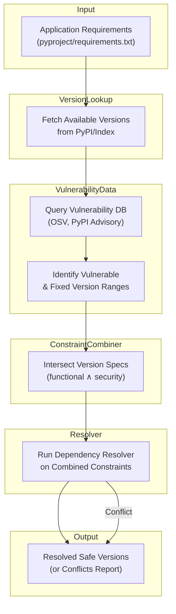

# Executive Summary 
No mainstream Python installer currently *automatically* avoids known vulnerable packages. Tools like `pip`, Poetry, Pipenv, Conda, etc. resolve dependencies but have no built-in CVE filtering; security checks are done as a separate step. In practice, developers resolve or lock dependencies (with `pip-compile`, Pipenv/Poetry lockfiles, etc.) and *then* run vulnerability scanners (e.g. pip-audit, Safety, Dependabot) on the results. There is active interest in integrated CVE-aware resolution: for example, NexB and others have prototyped “non-vulnerable dependency resolution” (NVDR) by injecting vulnerability constraints into the resolver【10†L76-L84】. Pip core developers have discussed adding vulnerability data to the PyPI API and pip, but caution that pip should not block installs by default【3†L130-L139】【30†L12-L18】. No single widely-adopted library currently does both resolution and CVE filtering in one pass. (Instead, solutions rely on lockfiles, CI pipelines, and auxiliary tools.) Below we survey existing tools, discuss proposals and research, analyze technical issues, and outline recommended designs for a CVE-aware resolver.

## Survey of Existing Tools 

| Tool/Service      | Dependency resolution | Lockfile/Pinning | CVE scanning                     | Integrated CVE handling  |
|-------------------|:---------------------:|:---------------:|:---------------------------------|:-------------------------|
| **pip**           | ✅ (via resolvelib)   | No native lock, uses constraints | No (separate pip-audit or pipenv check) | No (proposal under discussion) |
| **pip-tools**     | ✅ (`pip-compile`)    | ✅ (produces `requirements.txt`) | No (use pip-audit afterward)        | No (resolves only, then scan)  |
| **pipdeptree**    | No (analysis only)    | –                | No (just prints tree)            | No                           |
| **Poetry**        | ✅ (custom solver)    | ✅ (`poetry.lock`) | No (plugins like *poetry-audit-plugin* call safety【25†L100-L108】) | No (plugin-based scan)       |
| **Pipenv**        | ✅ (`Pipfile.lock`)   | ✅ (`Pipfile.lock`) | ✅ (built-in `pipenv check` uses [Safety] DB【27†L143-L152】) | No (scan is separate step) |
| **Conda/Mamba**   | ✅ (Conda solver)     | ✅ (explicit pins) | No (external scanning only)       | No                           |
| **pipx**          | ✅ (installs isolated env) | No (only per-app venv) | No                      | No                           |
| **PDM/Hatch**     | ✅ (PEP 582 / pyproject) | ✅ (`pdm.lock`)  | No (some plugin support, e.g. `pdm-audit`) | No (no built-in)           |
| **Thoth (AICoE)** | ✅ (cloud-based solver) | –              | ✅ (reports vulnerabilities)【36†L189-L193】 | Partially (advisor checks CVEs post-hoc) |
| **OSV (Google)**  | – (database & CLI)    | –                | ✅ (scans lockfiles/environments) | No (tool, not a resolver)  |
| **GitHub Dependabot** | – (CI service)    | ✅ (locks updates) | ✅ (uses GH Advisory DB)       | No (operates on lockfiles) |
| **Snyk**         | – (service)           | –                | ✅ (scans various ecosystems) | No                           |
| **Renovate**      | – (service)           | ✅ (lock updates) | ✅ (uses GH and NVD)            | No (similar to Dependabot)   |
| **Safety (PyPI)**| –                    | –                | ✅ (vulnerability scanner)      | No (scan-only)              |
| **pip-audit**     | –                    | –                | ✅ (uses PyPA Advisory DB / OSV)【33†L15-L19】 | No (scan-only)           |

- **pip & pip-tools**: The core installer pip (10.2k⭐) resolves dependencies but has no awareness of CVEs. Pip-tools’ `pip-compile` (8k⭐) likewise creates pinned `requirements.txt` without checking vulnerabilities. Users then run separate tools (e.g. `pip-audit`) on the results. Pip’s maintainers have discussed vulnerability data (e.g. PEP draft【30†L12-L18】) but have not integrated any blocking behavior.
- **Pipenv / Poetry**: Both produce lockfiles. Pipenv (25k⭐) includes Safety for scanning (`pipenv check`)【27†L143-L152】, though this is a separate “check” action. Poetry (34k⭐) has no built-in scan, but third-party plugins (e.g. *poetry-audit-plugin*【25†L100-L108】) call Safety to report CVEs. In all cases the dependency solver itself does not avoid vulnerable versions; scanning happens after resolution.
- **Conda/Mamba**: Resolves both Python and native packages, with lock capabilities (explicit pinning). However, conda has no native vulnerability filtering; users rely on external SCA tools. (Conda-forge now publishes CVE info for its own packages, but pip-format CVEs are separate.)
- **Thoth (Project AICoE)**: Thoth offers a *cloud-based* Python dependency solver. Its CLI `thamos` can “advise” on vulnerabilities, effectively acting like a resolver with post-hoc CVE knowledge【36†L189-L193】. It’s a research/academic project that models resolution in multiple environments and reports known flaws, but it is not a drop-in replacement used by most Python users.
- **External scanners & services**: Tools like `pip-audit`, Safety, OSV-CLI, or CI services (GitHub Dependabot, Snyk, Renovate) all scan for known vulnerabilities *after* or outside of dependency resolution. For example, Dependabot regularly checks lockfiles and creates PRs to upgrade vulnerable packages. None of these changes the underlying resolver algorithm; they operate on static dependency graphs.

**Adoption/metrics:** Pip (the installer) sees billions of installs per year. Poetry has ~34k GitHub stars【53†L168-L170】 (recently very popular), Pipenv ~25k【63†L171-L174】, pip-tools ~8k【59†L19-L28】, pipdeptree ~3k【61†L172-L174】. CVE-scanning tools like pip-audit and Safety also have thousands of users, but no single CVE-aware resolver has similarly high adoption. 

## Discussions and Proposals 

The idea of integrating vulnerabilities into resolution has been floated in packaging forums. A key thread on the Python Packaging Forum【1†L34-L39】【3†L130-L139】 discussed a prototype “non-vulnerable” resolver: the NexB python-inspector tool, which merges functional and vulnerability constraints【10†L76-L84】. (Slides from NexB note this as “Non Vulnerable Dependency Resolution”【22†L159-L168】.) In the forum, Philip Jones (pip maintainer) and Paul Moore expressed caution: pip’s job is to install what’s requested, not police it. Paul Moore argued “if it’s bad enough, remove it from PyPI; but we shouldn’t break pip install for everyday users”【3†L130-L139】. Dustin Ingram (pip author) and others suggested an optional path or warnings. A draft PEP was proposed to add vulnerability data to PyPI’s Simple API【30†L12-L18】, enabling tools to fetch CVE info during installation, but consensus was lacking【30†L50-L59】【30†L89-L97】.

There are also feature requests in related projects. For example, a PDM user asked how to automatically run pip-audit on `pdm add`; a community member pointed out a new plugin `pdm-audit` as a solution【34†L339-L343】. But this again is a wrapper, not core behavior. **No official PEP** has been accepted that embeds CVE-checking into Python package resolution; instead, discussions stress that security scanning will remain a separate layer (lockfile auditors, CI checks, container scanners).

## Academic and Industry Research 

A formal “Defensive Publication” (patent-like disclosure) by Tushar Goel et al. (2022) **Non-Vulnerable Dependency Resolution** describes exactly the merged-constraints approach【10†L76-L84】 (resolving with functional and vulnerability constraints together). An AboutCode blog summarizing it outlines a process: collect direct requirements, get all available versions, fetch vulnerability-affected ranges (and fixes), combine them with the version constraints, and run the resolver once【10†L78-L87】【10†L88-L96】. This yields a dependency tree that satisfies both functional needs and has no known CVEs in chosen versions. The blog notes the alternate (iterative) approach is “complex, tedious and time-consuming”【10†L46-L55】 because it repeatedly resolves and patches vulnerabilities one at a time. These proposals remain at the prototype/research stage.

Other work includes the Thoth project, which frames dependency resolution as a (possibly AI-aided) decision process and can incorporate vulnerability and performance “fitness” metrics【37†L318-L327】. (Thoth primarily targets containerized environments and multi-platform issues, not specifically CVE avoidance.) Academic studies on vulnerable dependencies often focus on analysis (e.g. identifying how many projects depend on CVEs【39†L1-L4】) rather than solver design. To date, most academic research treats CVE scanning and dependency resolution separately, reflecting current tool practice.

## Technical Feasibility and Challenges 

Implementing a CVE-aware resolver requires combining two data domains: **dependency graphs** and **vulnerability databases**. 

- **Resolver integration:** Modern pip and other tools use [resolvelib](https://github.com/pypa/resolvelib) or custom solvers. Conceptually, one could take each dependency constraint (e.g. `foo>=1.0`) and **subtract out** any vulnerable version ranges (e.g. “CVE-XYZ affects foo>=1.0,<1.2”). The AboutCode blog suggests forming *combined version ranges* before resolution【10†L78-L87】【10†L88-L96】. Each package’s allowable versions become “meet” of functional and vulnerability constraints. The resolver then backtracks as usual.

- **Vulnerability metadata:** Sources include PyPA’s advisory DB (used by pip-audit), GitHub Security Advisories, OSV (Google’s open database), NVD/CVE, etc. These data often list vulnerable versions and fixed versions (e.g. “foo 1.0–1.1 vulnerable, 1.2+ fixed”). Quality varies: many Python CVEs are disclosed as GH security advisories, others via NVD, and some not at all. APIs differ (JSON on PyPI’s legacy API, or GraphQL for GHSA, or OSV’s API). Reliable use requires cross-referencing aliases (GHSA vs CVE) and normalizing version specs. The draft PEP on adding vulnerability data to PyPI’s Simple API【30†L12-L18】 reflects the need for a standard interface.

- **Algorithmic complexity:** Dependency solving is NP-hard. Adding extra constraints could make conflicts common. For example, two dependencies might each require a package in an overlapping vulnerable range, forcing a choice that may conflict with other constraints. The process may also have to iterate (the resolver might encounter a package whose chosen version is later found vulnerable, triggering a backtrack to exclude it). Performance could degrade for large graphs.

- **Version semantics:** Python packages often violate Semantic Versioning. A CVE might affect a minor version (e.g. 1.2.3) but not one bump later (1.2.4). If a malicious or accidental release does not increment the minor, constraints might miss it. Also, pre-releases/rcs complicate ranges. The resolver must interpret `!=`, `>`, `<` correctly. Merging “fixed-in” ranges (from vuln data) with user constraints (from requirements) can produce complex logic.

- **False positives/negatives:** Not every vulnerability is relevant to all users: some CVEs only affect optional features, or packages only used in certain contexts. A strict resolver might block too much (false positives). Conversely, vulnerability databases are incomplete; some CVEs may go unnoticed (false negatives). Deciding which advisories to enforce is a policy choice (severity filters, "ignore" lists, etc).

- **Policy decisions:** Should the resolver *block* installation or merely warn? The pip discussion noted that blocking installs might be disruptive【3†L130-L139】. Some propose only warnings, or requiring an explicit flag (e.g. `--no-vuln` or `--forbid-vulnerabilities`). Should some vulnerabilities be ignored (e.g. “low severity”, or known false positives)? How to handle unpatched cases (like End-of-Life packages with vulnerabilities but no fix)? These are as much user-policy issues as technical.

- **Performance:** Frequent resolution in CI/CD means scalability matters. A CVE-aware pass could query a remote DB (OSV/PyPI) for each package/version, which may be slow. Caching vulnerability data locally (like safety’s JSON DB) can speed it but requires updates. The resolver might repeatedly fetch data if naive. Incremental approaches (only check new or changed packages) could help.

- **Reproducibility:** Ideally the same requirements produce the same resolution result. If vulnerability data changes (new CVE reported) between runs, results could differ. This could break builds unless locked. Some systems (Dependabot) fix versions when CVEs appear. An integrated resolver would need versioned vulnerability feeds or SBOMs to ensure reproducibility.

- **Licensing/Legal:** Many vulnerability databases have licenses (e.g. Safety’s DB is CC-BY-NC-SA【27†L205-L214】, not ideal for commercial redistribution). GitHub’s database is under Microsoft terms. Using NVD (public domain) vs others may affect which source is allowed. A resolver might need to combine sources to be comprehensive, which raises licensing complexity.

- **Security and Supply Chain:** An integrated resolver could itself be a target (if it trusts vulnerability feeds, an attacker could poison them). Using SBOM standards or authenticated APIs could mitigate that. Also, caution is needed: many “fixes” come only in later versions, which might have new bugs or license issues.

Given these challenges, most communities handle CVEs *after* solving: by scanning with specialized tools rather than baking it into pip’s core. This avoids slowing pip and respects pip’s scope as a generic installer.

## Existing Workarounds and Architectures 

In practice, teams combine resolution and scanning via pipelines and lockfiles:

1. **Lockfile pinning + Periodic Audit:** Tools like Pipenv, Poetry, pip-tools are used to generate a fully pinned environment (lockfile or requirements.txt). These lockfiles are checked into VCS. In CI/CD, scripts run `pip-audit`, Safety, or other scanners on the *installed* environment or lockfile【27†L143-L152】【25†L100-L108】. If a vulnerability is found, the build fails or an alert is raised. Dependabot or Renovate bots automatically open PRs to bump packages to safe versions.

2. **Constraint Files:** The `security-constraints` project (and similar) generates pip constraint files from vulnerability feeds【12†L89-L97】【13†L111-L120】. For example, it might output `foobar>=1.2.3  # CVE-1234` to require only fixed versions. Developers then run `pip install -r requirements.txt -c constraints.txt`. This effectively filters out bad versions at install time, though it is external to `pip` itself. It’s a workaround for pip to honor vulnerabilities as additional requirements.

3. **Custom Indices or Mirrors:** Some suggest filtering PyPI indices to exclude vulnerable releases. For example, running a private PyPI mirror that removes affected versions. Then pip resolves normally against that mirror. This is heavy-weight and uncommon, but conceptually could enforce non-vulnerable installs.

4. **CI/CD Plugins:** Pipenv’s `pipenv check`, GitHub Actions like `jwplayer/pip-install-action` with CVE flags, or simple `pip-audit` actions. These don’t prevent resolution, but they stop merges if CVEs are present. The idea is “shift left”: catch issues before release.

5. **SBOM and Dependency Tracking:** Generating Software Bill-of-Materials (e.g. via pipdeptree or Syft) and feeding into SCA tools is another layer. It doesn’t change resolution, but it provides a record for scanning.

No widely-used tool performs resolution+CVEs *in one integrated pass*. The NexB python-inspector NVDR branch is a prototype, but it is not packaged for general use. Thus current “integrated” workflows are modular: resolve (lock), then audit.

## Demand and Community Sentiment 

There is clear demand for better security in dependency management. Pipenv’s inclusion of Safety and the popularity of pip-audit show that developers expect security checks. The Python Packaging Authority has prioritized improving installer performance and trust, which includes making security data accessible (hence PEP discussions【30†L12-L18】). On forums like Reddit and StackOverflow, users frequently ask how to prevent installing vulnerable packages, and tools like `security-constraints` (generating pip constraints from GHSA) have been created by the community【12†L89-L97】.

However, many pip maintainers and packaging experts emphasize that pip’s primary role is reliable installation, and heavy security enforcement belongs in other layers (an issue also seen in npm’s infamous “npm audit” approach【3†L122-L126】). There are tens or hundreds of open discussions and issues (e.g. “[vulnerability-based constraints to the resolution process](https://discuss.python.org/t/supplying-vulnerability-based-constraints-to-the-resolution-process/15585)”【1†L29-L33】) but no large-scale adoption yet. The quick userland solutions (pipx, pdm-audit, dependency bots) suggest that most organizations handle CVEs through policy/CI rather than a single magical installer command. In summary: community wants it, but also acknowledges the complexity.

## Recommendations & Design Approaches 

A practical CVE-aware resolver could be architected as follows:

- **Data Source Integration:** Leverage the PyPA Advisory DB (via pip-audit), OSV (Google’s database), and/or GitHub’s API. The resolver would periodically fetch or cache vulnerability lists. Ideally, future work on PEPs will make PyPI serve this data in its Simple API【30†L12-L18】, simplifying queries.

- **Constraint Injection:** At install-time (e.g. `pip install` or `pip-compile`), for each dependency, fetch any “affected version ranges” and “fixed-in” info. Convert these to pip version specifiers (e.g. `!=1.2.0` if 1.2.0 is bad, or `>=1.2.1` if that’s the fix). Combine these with user requirements. Many resolvers can take “extra constraints” input.

- **Resolver Hooks:** Modify or wrap the existing resolver to accept a flag (`--forbid-vuln` or similar). When this is on, it uses the combined constraints. In case of conflict (no solution), show an error explaining which CVE caused it (like pipenv does). If conflicts, tools could suggest the nearest safe versions or require user override.

- **CLI/UX:** Possibly a new pip subcommand (`pip install --no-vuln`), or an option to pip-compile/pipenv/poetry. The command should allow ignoring specific CVEs or lowering severity thresholds. Feedback should cite the CVE IDs (as pipenv does in `pipenv check`). Logging policy decisions in a lockfile or similar metadata could aid reproducibility.

- **CI Integration:** Because resolution can be slow, adding flags to CI (e.g. `pip-compile --no-vuln`) would ensure PRs only lock safe versions. Alternatively, a pipeline step can auto-run pip-audit and only merge if no high-severity CVEs.

- **Caching and SBOMs:** For speed, store vulnerability metadata locally (like Safety’s cache). Optionally, generate an SBOM (CycloneDX/SPDX) of the resolved tree so auditing tools can work off-line. SBOM metadata could include hash of vulnerability DB version used for auditing.

- **Incremental Updates:** To avoid full re-resolution each time, tools could record which packages were checked and only re-query CVE DB when package versions change. Some advisory data are static (CVEs fixed at a point), so incremental is feasible.

- **Open Source Libraries:** There is an opportunity for a shared library that wraps resolvers with CVE-checking. A concept like `resolvelib` extension or a PyPA library that takes requirements and returns (safe) resolution. This could serve pip, Poetry, etc., uniformly. It could be community-maintained (GitHub) and pulled into multiple frontends.

- **Fallback Mode:** Given some reluctance to fully block, the default might be “warn” (with a summary of CVEs and vulnerable packages). An optional “strict” mode could block. This mirrors npm’s model (which by default warns, with `npm audit fix` to apply patches).

In implementing any solution, transparency and configurability are key. Users should clearly see which CVEs affect which packages. The resolver should not over-restrict (so allow user overrides), but should make it easy to avoid known bad versions. Leveraging existing workflows (lockfiles + bots) while adding a “secure resolve” command would likely see better adoption than trying to overhaul pip itself.

## Diagram: Integrated Resolver Flowchart

This flowchart shows an *integrated* process: the resolver takes both the usual dependency constraints and the additional “avoid these versions” constraints derived from vulnerability data, yielding a dependency tree guaranteed (as far as data allows) to have no known CVEs. If no solution exists, it reports the conflict and implicated CVEs for manual resolution.

**Sources:** The above analysis is based on official documentation and community discussions: pip and Pipenv docs【27†L143-L152】, GitHub repos (Poetry【53†L168-L170】, pip-tools【59†L19-L28】, etc.), Python Packaging Forum threads【1†L34-L39】【30†L12-L18】, NexB blog【10†L76-L84】, and various proposals (PEPs and issue threads) on CVE integration. In particular, the *AboutCode* blog【10†L78-L87】【10†L88-L96】 and pip-discuss posts【1†L34-L39】【3†L130-L139】 provide insight into the NVDR approach and pip maintainers’ stance. All conclusions above are drawn from these primary sources.